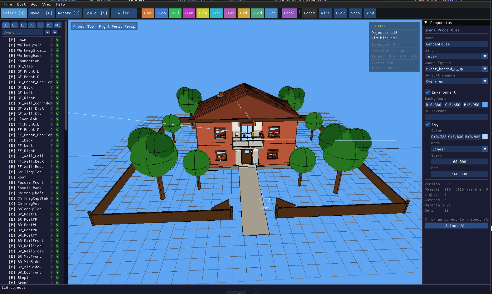

# MeshCraft

A C++23 3D scene editor for the `.mc3.xml` format — a lightweight XML-based scene description used by the OpenEggbert project.



## Description

MeshCraft lets you build and edit 3D scenes from primitive shapes, groups, materials, CSG boolean operations, and external OBJ meshes. Scenes are saved as `.mc3.xml` files and can be exported to glTF/GLB for use in games and real-time applications.

## The MC3 Format

MC3 (MeshCraft 3D) is an XML-based source format (`.mc3.xml`). It describes scenes as editable constructive objects rather than raw triangle meshes.

Key capabilities:

- primitive shapes: box, sphere, cylinder, cone, plane, torus, capsule, disk, grid, icosphere
- hierarchical groups and transforms (position, rotation, scale, pivot)
- materials: PBR (base color, roughness, metallic, emissive, normal/occlusion textures)
- CSG operations: union, difference, intersection (via Manifold)
- extrude along path (line, arc, helix, polyline, bezier)
- animation channels: position, rotation, scale, visibility, material color, deform
- reusable definitions (prefabs / instances)
- layers, tags, collision hints
- fog and environment settings
- export: glTF/GLB via `mc3togltf`; binary MCB via `mc3tomcb`

See [MC3_FORMAT.md](MC3_FORMAT.md) for the full specification.

## Architecture

| Component | Description |
|-----------|-------------|
| `mc3/` | Core library — `Mc3Document` data model, XML parser/writer, no graphics dependency |
| `mcb/` | MCB binary format read/write (fast runtime loading) |
| `mc3tomcb/` | CLI: convert `.mc3.xml` ↔ `.mcb` |
| `mc3togltf/` | CLI: export `.mc3.xml` → `.gltf` / `.glb` |
| `MeshCraft` | Editor application — Dear ImGui UI, orbit camera, gizmos, CSG, timeline |
| `../cna/` | XNA-like C++ runtime (SDL3 + OpenGL ES 3, sibling repo) |

## Building

### Prerequisites

- CMake 3.21 or newer
- C++23-capable compiler (GCC 13+, Clang 16+, MSVC 2022+)
- Python 3 + `lxml` (for XSD validation tests)
- Sibling repositories checked out next to `mesh-craft/`:
  - `cna/`
  - `sharp-runtime/`

### Build (Linux)

```sh
cmake -S . -B cmake-build-debug
ninja -C cmake-build-debug
```

### Build with SDL_RENDERER backend

```sh
cmake -S . -B cmake-build-debug -DMESH_CRAFT_GRAPHICS_BACKEND=SDL_RENDERER
ninja -C cmake-build-debug
```

> **Note:** sources are collected with `file(GLOB_RECURSE)`, so CMake does
> not automatically notice a newly added `.cpp` file. After adding one
> (or a new CMakeLists.txt-registered test executable), re-run the
> `cmake -S . -B cmake-build-debug` configure step before building —
> `ninja` alone will not pick it up.

### Build (Windows, MinGW cross-compile from Linux)

Requires the `x86_64-w64-mingw32-gcc`/`g++` toolchain (Debian/Ubuntu:
`apt install g++-mingw-w64-x86-64`). Write a toolchain file:

```cmake
# mingw-toolchain.cmake
set(CMAKE_SYSTEM_NAME Windows)
set(CMAKE_SYSTEM_PROCESSOR x86_64)
set(CMAKE_C_COMPILER x86_64-w64-mingw32-gcc)
set(CMAKE_CXX_COMPILER x86_64-w64-mingw32-g++)
set(CMAKE_FIND_ROOT_PATH /usr/x86_64-w64-mingw32)
set(CMAKE_FIND_ROOT_PATH_MODE_PROGRAM NEVER)
set(CMAKE_FIND_ROOT_PATH_MODE_LIBRARY ONLY)
set(CMAKE_FIND_ROOT_PATH_MODE_INCLUDE ONLY)
```

```sh
cmake -S . -B b-mingw -G Ninja -DCMAKE_TOOLCHAIN_FILE=mingw-toolchain.cmake -DBUILD_TESTING=OFF
cmake --build b-mingw -j$(nproc)
```

**Known blocker (as of this writing):** configure succeeds and the
build progresses through ~73% of the object graph (all of CNA's
XNA-compatibility layer, `Mc3`, Manifold, most of ImGui), then fails on
`imgui_impl_opengl3.cpp: fatal error: GLES3/gl3.h: No such file or
directory` — CNA's build configures `-DIMGUI_IMPL_OPENGL_ES3`
unconditionally for the `EASYGL` backend regardless of target platform,
and no GLES-for-Windows headers are vendored. This is a CNA-side
graphics-backend decision, not something this repo can fix on its own —
see `cna`'s own issue tracker. SQLite3/OpenSSL/LibXml2 all gracefully
disable (stubbed at compile time) rather than blocking configure when
absent for the target, and the produced `build.ninja` correctly copies
`SDL3`/`SDL3_image`/`SDL3_mixer`/`libwinpthread-1` DLLs next to
`MeshCraft.exe` and statically links `libgcc`/`libstdc++`.

### Build (Web, Emscripten)

Requires the [Emscripten SDK](https://emscripten.org/docs/getting_started/downloads.html)
(`source emsdk_env.sh` puts `emcmake`/`emcc`/`em++` on `PATH`):

```sh
emcmake cmake -S . -B b-web -G Ninja -DBUILD_TESTING=OFF
cmake --build b-web -j$(nproc)
cd b-web && python3 -m http.server 8765   # then open http://localhost:8765/MeshCraft.html
```

Builds and links cleanly (449/449 objects) and the produced page loads
and initializes correctly in a real browser (WebGL 2.0 context,
`SDL_CreateWindow` succeeds, no console errors) — **but the 3D viewport
currently renders a blank canvas**, an open, undiagnosed limitation (see
`NEXT.md` §4 for what's been ruled out so far). CLI tools (`mc3togltf`,
`mc3tomcb`) build the same way and run correctly under Node.

### Run

```sh
./cmake-build-debug/MeshCraft path/to/scene.mc3.xml
```

### Export to glTF

```sh
./cmake-build-debug/mc3togltf/mc3togltf scene.mc3.xml scene.glb
./cmake-build-debug/mc3togltf/mc3togltf --stats scene.mc3.xml scene.glb  # print export statistics
```

### Convert to MCB

```sh
./cmake-build-debug/mc3tomcb/mc3tomcb scene.mc3.xml scene.mcb
```

### Tests

```sh
ctest -V --test-dir cmake-build-debug
```

## Current Features

- Full `.mc3.xml` scene load/save with XML roundtrip
- All primitive types rendered in 3D viewport
- Transform gizmos (move / rotate / scale), local/world space
- Object hierarchy panel with selection, multi-select, drag-and-drop
- Properties panel (geometry, material, transform), multi-edit
- Material editor (PBR: base color, roughness, metallic, emissive)
- CSG boolean operations (union, difference, intersection via Manifold)
- Extrude along path (arc, helix, polyline, bezier cross-sections)
- Animation timeline: keyframes, channels, cubic/step/linear interpolation
- Named layers, object tags, collision hints
- Fog, environment background, emissive bloom post-process
- First-person walk mode
- GLB export settings UI; headless screenshot mode
- Undo/redo (20-step deep-copy stack)
- Auto-save with rotating backups
- MCB binary format (`mc3tomcb`)
- glTF/GLB export (`mc3togltf`) with geometry reuse — repeated identical primitives, OBJ meshes, extrude shapes, and `<instance>` nodes share one glTF mesh buffer per unique geometry+material combination

## Current Limitations

- Bloom post-process: pipeline runs (FBO + Gaussian blur + composite) but visual effect not always visible depending on scene emissive brightness
- Walk mode: floor collision at y=0 only; no collision with scene geometry
- Preferences dialog: auto-save interval, snap (translate/rotate/scale), grid spacing, and theme are all persisted (`savePrefsAlg`/`loadPrefsAlg`)
- Headless screenshot: always writes PPM regardless of file extension
- MCB: compression flag reserved in header but not implemented
- CSG export to glTF: evaluated by Manifold (union/difference/intersection). Unsupported child types inside a CSG node (Plane, Disk, Grid, Mesh, Extrude) cause the export to fail with a clear error in default mode. Pass `--allow-approximate-csg` (CLI) or enable "Allow approximate CSG export" (editor) to bypass Manifold and export children separately (debug fallback, geometrically incorrect). CSG result mesh has flat normals; child materials are not preserved (CSG root material is used)
- No automated UI tests; only XML roundtrip and smoke test
- AI Assistant: not available on Emscripten or Android builds (`cpp-httplib`/OpenSSL are only fetched/linked when `NOT EMSCRIPTEN AND NOT ANDROID`). The API key is **never persisted to disk** — it lives only in the in-memory UI text buffer for the session, pre-filled from the `ANTHROPIC_API_KEY` environment variable if set, and is not part of the saved preferences file. Response validation is structural, not semantic: it checks the XML is well-formed, has a `<mc3>` root, isn't empty, and conforms to `mc3.xsd` (element order, attribute types/patterns, ID/IDREF cross-references) — but `mc3.xsd` has no numeric range constraints (no `minInclusive`/`minExclusive` anywhere), so a geometrically nonsensical response (e.g. negative `size`/`radius`) passes validation and applies to the scene as-is
- Model Registry: no thumbnail column (design placeholder only, never implemented — see `m1m2m3.md`); requires the system SQLite3 library on desktop builds (stubbed out, feature disabled, on Emscripten/Android); no sync between multiple registry database files — it's a single local SQLite file at `~/.meshcraft/modelregistry.sqlite3`, not backed up or shared automatically
- SVG textures (`<texture type="svg">`): parsed, serialized, and round-tripped, but never rasterized — `mc3togltf`'s `GltfExporter` doesn't read the SVG texture map at all, so an SVG-sourced texture is silently dropped from glTF export, not just deferred. Blocked on picking a rasterization library (librsvg vs. NanoSVG)
- Embedded glTF (`<mesh src="embed:id"/>`): parsed and serialized, but `GltfExporter` treats `embed:id` as a literal OBJ file path, which fails to parse — the export doesn't crash, but the node exports with no mesh (see `MC3_FORMAT.md`'s export support matrix)
- N3–N7 scene data (scripts, sounds, music, triggers, scene states, meta): fully round-tripped (XML/MCB/XSD) but not executed at runtime — no Lua interpreter, no audio playback, no trigger-firing event system, no state-switching logic (data model first, by design at this stage — see `MC3_FORMAT.md`'s per-section status notes)

## Platform Support Matrix

Status as of the S16 (Cross-Platform Stability) stabilization pass.
Legend: ✅ verified working &nbsp; 🟡 partially verified / known gap &nbsp;
❌ not available on this platform &nbsp; ❓ not yet attempted (no toolchain
available to test with).

| Feature | Linux | Windows (MinGW) | Web (Emscripten) | Android |
|---|---|---|---|---|
| Full desktop/native build | ✅ | 🟡 builds to ~73% (328/449 objects), then fails on a CNA-side `GLES3/gl3.h` header gap — CNA configures `-DIMGUI_IMPL_OPENGL_ES3` unconditionally for the `EASYGL` backend regardless of target platform | ✅ 449/449, exit 0 | ❓ never attempted (no Android NDK installed here) |
| App launches / runs | ✅ | ❌ (build doesn't complete) | 🟡 loads, initializes (`SDL_CreateWindow`, WebGL2 context), no crash — but renders a blank canvas, not yet visually usable | ❓ |
| 3D viewport rendering | ✅ | ❌ (build doesn't complete) | ❌ blank canvas — root cause not yet diagnosed (needs frame-level GL diagnostics + a browser retest) | ❓ |
| Shaders (GLSL ES 3.00 / WebGL2) | ✅ (desktop GL) | ❌ (build doesn't complete) | ✅ all 7 CNA EasyGL 3D shader programs are `#version 300 es` and compile/link cleanly | ❓ |
| Config/prefs/recent-files/keybindings persistence | ✅ `~/.config/meshcraft` | ✅ `%APPDATA%\meshcraft` (code-verified; no working build to run it against yet) | ✅ IDBFS-mounted `$HOME/.config/meshcraft`, survives reload (code/build-verified; needs a live-browser round-trip to fully confirm) | ❓ (falls through to the same non-Windows `$HOME`-based logic as Linux; not verified on-device) |
| SQLite Model Registry | ✅ (or gracefully stubbed if SQLite3 dev package absent) | 🟡 gracefully stubbed when SQLite3 absent (code-verified; no working build to run it against yet) | ❌ always stubbed (`MESHCRAFT_HAS_SQLITE3` never defined) | ❌ always stubbed (same guard as Web) |
| AI Assistant (Claude API) | ✅ (or gracefully stubbed if OpenSSL absent) | 🟡 same as SQLite3 above | ❌ always stubbed (`MESHCRAFT_HAS_AI` never defined) | ❌ always stubbed (same guard as Web) |
| File dialogs (text-path-field fallback) | ✅ | ✅ (no native OS dialog anywhere — plain `ImGui::InputText`, platform-agnostic by construction) | ✅ | ✅ |
| Path handling (UTF-8, spaces, separators) | ✅ (round-trip tested) | ✅ (`std::filesystem::path` used consistently; not executable-tested on real Windows) | ✅ (`std::filesystem::path`; not executable-tested) | ✅ (same code path) |
| Static runtime linking / DLL bundling | N/A | ✅ `-static-libgcc -static-libstdc++`, plus `SDL3`/`SDL3_image`/`SDL3_mixer`/`libwinpthread-1` DLLs copied next to the `.exe` (build-graph verified) | N/A (single `.wasm`, no separate runtime DLLs) | ❓ |
| wasm exceptions / preloaded test assets | N/A | N/A | ✅ `-fwasm-exceptions` on compile+link; `--preload-file test@/test` packages all `test/` assets into `MeshCraft.data` | N/A |
| CI | ❌ workflow exists but is parked at `.github_/workflows/ci.yml` (not `.github/`) pending git remote credentials with the right scope — not platform-specific, blocks all four | | | |

## Reporting a Crash

MeshCraft has no built-in crash reporter — if it crashes, capture a
backtrace with the OS-standard tools below and attach it to a
[GitHub Issue](https://github.com/openeggbert/mesh-craft/issues) along
with the scene file (if any) and the exact command line that triggered
it.

**Linux:**

```sh
# Debug build already has debug info (see "Build (Linux)" above)
ulimit -c unlimited                       # enable core dumps for this shell
./cmake-build-debug/MeshCraft scene.mc3.xml
# after it crashes, find the core file (verified: named core.<pid> by
# default on this system — check `cat /proc/sys/kernel/core_pattern`
# if yours differs) and load it:
gdb ./cmake-build-debug/MeshCraft core.<pid>
(gdb) bt full                              # full backtrace — this is what to attach
```

If it hangs instead of crashing, attach a backtrace from a running
process instead: `gdb -p $(pgrep MeshCraft) -batch -ex "bt full"`.

**Windows:** no build/test verification of this exists in this
environment (Linux-only dev setup) — the standard approach is to let
Windows Error Reporting generate a `.dmp` file (Control Panel → System
→ Advanced → check "Windows Error Reporting" settings, or trigger one
directly via Task Manager → right-click the hung/crashed process →
"Create dump file") and open it in WinDbg or Visual Studio for a
backtrace. Treat this as unverified guidance, not a tested procedure.

## Backup and Recovery

Auto-save and backups live **next to the scene file itself** — there is
no separate cache/config directory for them.

- **Auto-save**: while a file `scene.mc3.xml` is open, the editor
  periodically writes the current in-memory state to
  `scene.mc3.xml.autosave` (interval configurable in Preferences,
  default 60s). This file is deleted automatically on the next explicit
  Save — it's a crash-recovery net, not a permanent artifact.
- **Recovering after a crash**: reopen `scene.mc3.xml` normally. If a
  `.autosave` file exists and is newer than the saved file, the status
  bar shows "Autosave found — may be newer than saved file: ..." for a
  few seconds — this is a **notification only**, not an automatic
  prompt with a restore button. To actually recover: open
  `scene.mc3.xml.autosave` directly (File → Open, or rename it to end
  in `.mc3.xml` first since the app expects that extension), check it
  looks right, then Save As over the original filename.
- **Backup rotation on every explicit Save**: before writing, the
  previous on-disk content is preserved as `scene.mc3.xml.backup.1`
  (most recent prior version); if a `.backup.1` already existed, it's
  first renamed to `scene.mc3.xml.backup.2` (previous-to-that version)
  — a fixed 2-slot ring buffer, nothing older than 2 saves back is
  kept. To recover from a bad save (e.g. accidentally saved over good
  work with something wrong), copy `.backup.1` (or `.backup.2` for one
  save further back) over `scene.mc3.xml`.

## License

MIT — see [LICENSE](LICENSE).
